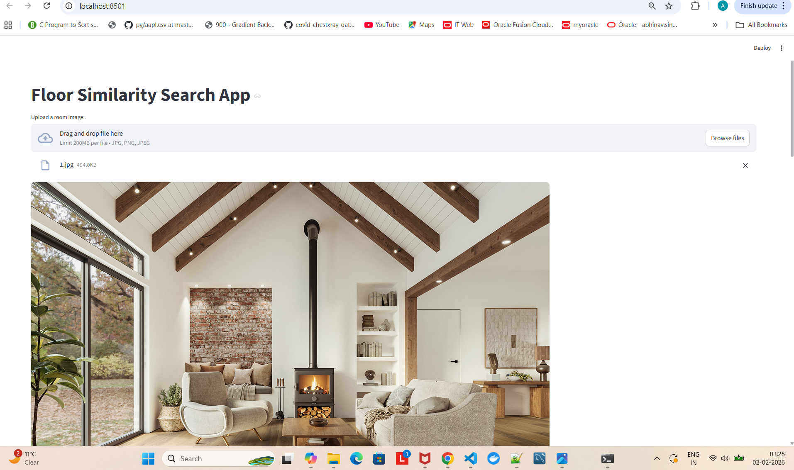
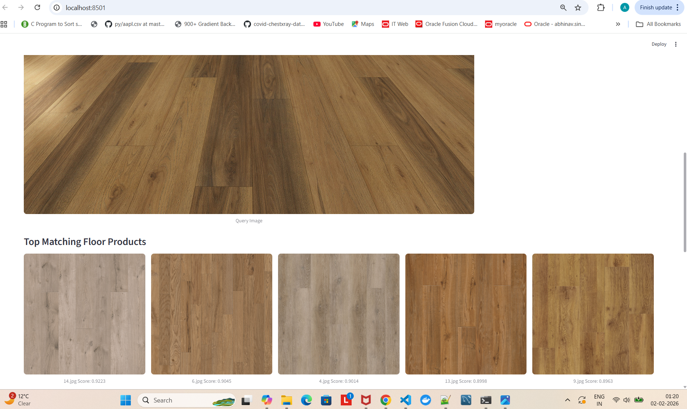
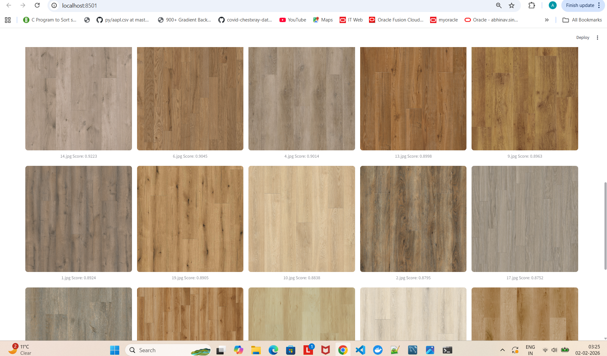

# Floor Visual Similarity Search
Designed and implemented a system that, for each query image, ranks all 20 product images from most similar to least similar, based on how closely the floor in the room matches the product image by focusing only on floor appearance (color, texture, pattern, material).

## Approach

### For Storing product images
```
Generated CLIP embeddings for all product images using CLIP model and stored them in Pinecone Pinecone vector database along with metadata:
    - Image filename
    - Material type (e.g., wood, laminate)
    - Source (e.g., CLIPSeg)

```

### For Querying room image
```
Step 1- Floor Segmentation – Extracted only the floor region from room images using CLIP segmentation model and crop the floor region based on CLIP segmentation in order to remove walls, furniture, and other irrelevant areas.
```
```
Step 2- Embedding – Generate CLIP embeddings for floor regions.

```
```
Step 3- Semantic Retrieval – Queried Pinecone with the generated embedding to retrieve top-k candidate product images using cosine similarity.

```
```
Step 4- Hybrid Re-ranking – Reranked retrieved results using CLIP pairwise similarity between the query floor region and each top-k candidate product image to capture fine-grained visual differences such as texture and color.
```

# Flowchart

```

Query image
   ↓
Floor segmentation (CLIP Seg)
   ↓
CLIP embedding
   ↓
Pinecone
   ↓
CLIP pairwise similarity (re-rank)
   ↓
Final ranking

```
# Models & Techniques Used

### Floor Segmentation: 
```
CIDAS/clipseg-rd64-refined
```

### Image Embeddings: 
```
openai/clip-vit-base-patch32
```

### Vector Search: 
```
Pinecone (cosine similarity)
```

# Techstack Used:
- Backend: FASTAPI (Python)
- Frontend: streamlit
- Database: Pinecone

# Steps for Project Setup

### STEP-1: Clone the repository

```
git clone https://github.com/abhinav7876/Visual_Similarity.git
```
### STEP-2: Create a conda environment after opening the repository

```
conda create -p venv python==3.10 -y
```

```
conda activate venv/
```


### STEP-3: install the requirements

```
pip install -r requirements.txt
```


### STEP-4: Create a `.env` file in the root directory and add your Pinecone credentials as follows:

```
PINECONE_API_KEY = "xxxxxxxxxxxxxxxxxxxxxxxxxxxxx"
```

### STEP-5: Run the following command to store embeddings to pinecone

```

python store_index.py
```


# Running the Project

###  Start FastAPI backend

```
uvicorn main:app --reload --host 0.0.0.0 --port 8000
```

###  Start the Streamlit UI

```
streamlit run streamlit_app.py

```

UI will open in the browser.


# Screenshots






# Limitations

```
1. Differences in lighting, perspective, or camera angle can affect similarity results.

```

```
2. Subtle differences in wood grain or laminate pattern may not always be captured in a single embedding.

```